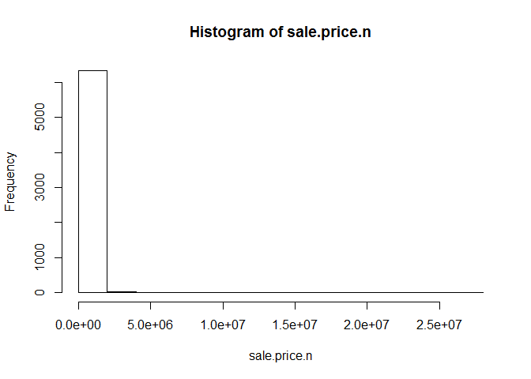
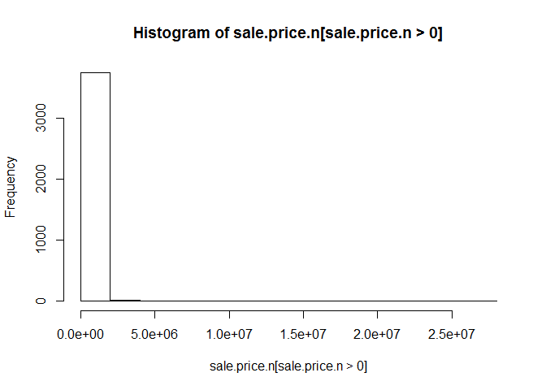
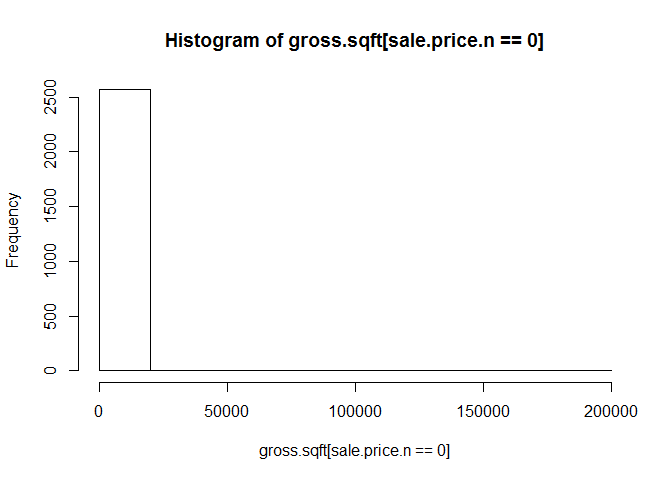
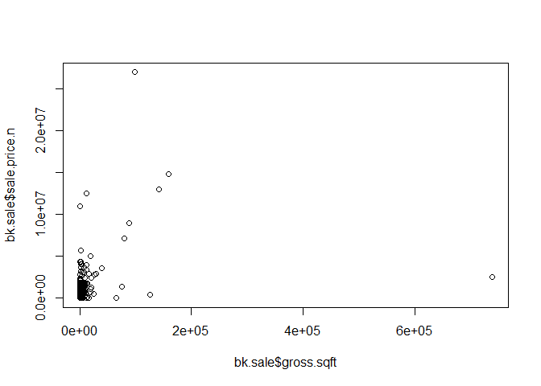
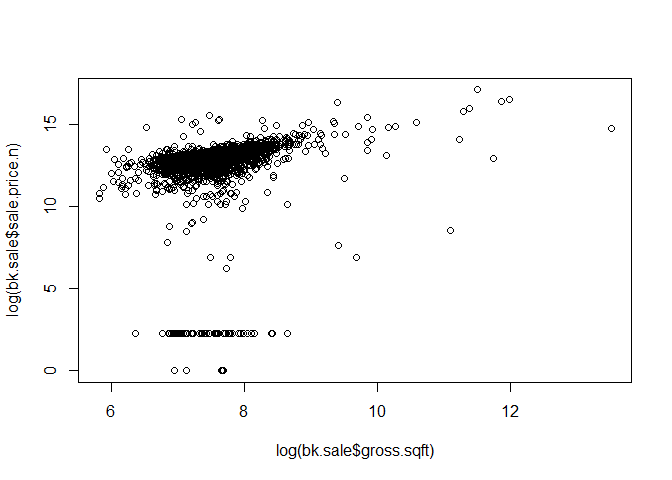
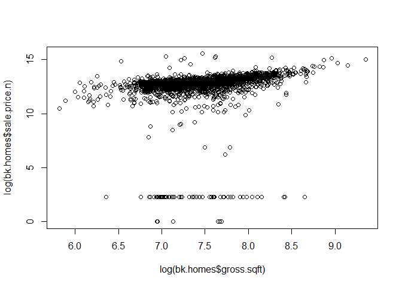
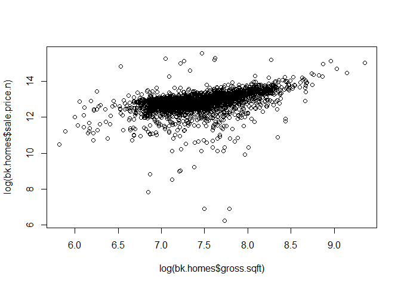

# Housing Sales Analysis for Staten Island borough
Johnny Quick, Olufemi Adesanya, and Celia Taylor  
June 1, 2016  

## Analysis of gross square feet to sales price

The following code calls the Main.R script which sets environment variables,
ensures packages are loaded that are needed, and then calls 3 R scripts:
LoadData.R, CleanData.R, and AnalyzeData.R

LoadData.R reads an Excel file for Staten Island Sales

LoadData.R will also produce the following output:  
  * Header of bk dataset  
  * 5-number summary of bk dataset  
  * Structure of bk dataset  

CleanData.R does the following:  
  * Cleans up sales price and makes it numeric  
  * Makes all variable names lower case  
  * Gets rid of leading digits for gross square feet and land  
  * Changes sales date to R's date format  
  * Subsets year from the sales date into a variable  
  * Removes homes with sales prices of 0  
  * Removes homes with sales prices that don't seem like actual sales  
  
CleandData.R will also produce the following graphics and output:  
  * Histogram of sale.price.n which shows us something is off here  
  * Histogram of sale.price.n for sales prices greater than 0  
  * Histogram of gross.sqft [sale.price.n==0]  
  * Plot gross.sqft related to sale.price.n  
  * Plot log(gross.sqft) related to log(sale.price.n)  
  * Check dimensions of bk.homes dataset which is 1-, 2-, and 3- family homes  
  * Plot log(gross.sqft) related to log(sale.price.n)  
  * 5-number summary of bk.homes dataset for homes with sale.price.n < 100,000  

AnalyzeData.R does a plot of gross square feet related to sales price  


```r
maind <- "/Users/Johnny/OneDrive/Documents/6306/Unit3/StatenIslandRepo"
setwd(maind)
source("Main.R")
```

```
## Loading required package: gtools
```

```
## Loading required package: gdata
```

```
## gdata: read.xls support for 'XLS' (Excel 97-2004) files ENABLED.
```

```
## 
```

```
## gdata: read.xls support for 'XLSX' (Excel 2007+) files ENABLED.
```

```
## 
## Attaching package: 'gdata'
```

```
## The following object is masked from 'package:stats':
## 
##     nobs
```

```
## The following object is masked from 'package:utils':
## 
##     object.size
```

```
## Loading required package: plyr
```

```
## 'data.frame':	6356 obs. of  21 variables:
##  $ BOROUGH                       : int  5 5 5 5 5 5 5 5 5 5 ...
##  $ NEIGHBORHOOD                  : Factor w/ 59 levels "ANNADALE                 ",..: 1 1 1 1 1 1 1 1 1 1 ...
##  $ BUILDING.CLASS.CATEGORY       : Factor w/ 34 levels "                                            ",..: 2 2 2 2 2 2 2 2 2 2 ...
##  $ TAX.CLASS.AT.PRESENT          : Factor w/ 11 levels "  ","1","1A",..: 2 2 2 2 2 2 2 2 2 2 ...
##  $ BLOCK                         : int  5395 5401 5401 5407 5425 6205 6205 6205 6211 6212 ...
##  $ LOT                           : int  32 10 38 11 39 16 55 126 20 28 ...
##  $ EASE.MENT                     : Factor w/ 2 levels " ","E": 1 1 1 1 1 1 1 1 1 1 ...
##  $ BUILDING.CLASS.AT.PRESENT     : Factor w/ 90 levels "  ","A0","A1",..: 3 4 3 3 3 6 6 6 6 3 ...
##  $ ADDRESS                       : Factor w/ 5777 levels "1 ASPINWALL STREET                       ",..: 4238 1111 2425 2130 2044 5432 3153 1646 5347 5514 ...
##  $ APART.MENT.NUMBER             : Factor w/ 207 levels "            ",..: 1 1 1 1 1 1 1 1 1 1 ...
##  $ ZIP.CODE                      : int  10312 10312 10312 10312 10312 10312 10312 10312 10312 10312 ...
##  $ RESIDENTIAL.UNITS             : int  1 1 1 1 1 1 1 1 1 1 ...
##  $ COMMERCIAL.UNITS              : int  0 0 0 0 0 0 0 0 0 0 ...
##  $ TOTAL.UNITS                   : int  1 1 1 1 1 1 1 1 1 1 ...
##  $ LAND.SQUARE.FEET              : Factor w/ 2113 levels "0","1,000","1,005",..: 400 311 312 1492 755 152 131 664 143 1567 ...
##  $ GROSS.SQUARE.FEET             : Factor w/ 1653 levels "0","1,000","1,002",..: 1408 612 683 292 1524 325 30 905 293 842 ...
##  $ YEAR.BUILT                    : int  1985 1980 1980 1910 1950 1986 1986 1986 1986 1970 ...
##  $ TAX.CLASS.AT.TIME.OF.SALE     : int  1 1 1 1 1 1 1 1 1 1 ...
##  $ BUILDING.CLASS.AT.TIME.OF.SALE: Factor w/ 90 levels "A0","A1","A2",..: 2 3 2 2 2 5 5 5 5 2 ...
##  $ SALE.PRICE                    : Factor w/ 1190 levels "$0","$1","$1,000",..: 16 1031 88 274 211 501 1 581 529 878 ...
##  $ SALE.DATE                     : Factor w/ 342 levels "2012-08-01","2012-08-02",..: 15 184 54 115 271 304 191 16 301 122 ...
```

<!-- --><!-- --><!-- --><!-- --><!-- --><!-- --><!-- -->

As you can see from the plot above, there is a positive linear relation between gross square feet and sales price for housing in the Staten Island borough
